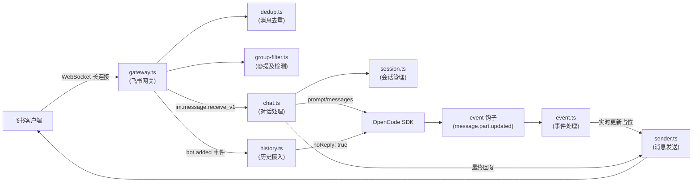

# OpenCode 飞书插件

**opencode-feishu** 是 [OpenCode](https://github.com/anomalyco/opencode) 的官方飞书插件（不是独立服务），通过飞书 WebSocket 长连接将飞书消息接入 OpenCode AI 对话。插件作为**消息中继**：所有消息（包括以 `/` 开头的命令）原样转发给 OpenCode，不解析命令、不选择模型或 Agent。

npm 包地址：[https://www.npmjs.com/package/opencode-feishu](https://www.npmjs.com/package/opencode-feishu)

---

## 主要能力

- **飞书 WebSocket 长连接**：使用飞书「事件与回调」的「长连接」模式接收消息，无需配置公网 Webhook 地址。
- **OpenCode 对话中继**：将飞书消息转为 OpenCode 会话的 prompt，通过轮询获取回复并回写到飞书。
- **群聊静默监听**：始终将群消息转发给 OpenCode 积累上下文，仅在 bot 被直接 @提及时才回复，避免刷屏。
- **入群上下文摄入**：bot 被拉入群聊时，自动读取最近 50 条历史消息作为 OpenCode 对话上下文。
- **事件流实时更新**：通过插件 `event` 钩子接收 `message.part.updated` 事件，实时更新「正在思考…」占位消息。

---

## 快速开始

### 前置条件

- **Node.js** >= 20.0.0
- **OpenCode**：已安装并能正常使用（参见 [OpenCode 文档](https://github.com/anomalyco/opencode)）
- **飞书自建应用**：在 [飞书开放平台](https://open.feishu.cn/app) 创建应用，获取 App ID 和 App Secret

### 方式一：从 npm 安装（推荐）

在 OpenCode 插件目录下安装：

```bash
# OpenCode 插件目录（Linux/macOS）
cd ~/.config/opencode/plugins

# 创建插件目录并安装
mkdir -p opencode-feishu
cd opencode-feishu
npm install opencode-feishu
```

### 方式二：从源码构建

```bash
git clone https://github.com/your-org/opencode-feishu.git
cd opencode-feishu
npm install
npm run build
```

### 本地开发安装（junction/symlink）

构建完成后，将项目目录链接到 OpenCode 插件目录，避免每次修改都需要重新复制文件。

**Windows（使用 junction，无需管理员权限）：**

```powershell
$source = "D:\path\to\opencode-feishu"
$target = "$env:USERPROFILE\.config\opencode\plugins\opencode-feishu"
New-Item -ItemType Junction -Path $target -Target $source
```

**Linux/macOS（使用 symlink）：**

```bash
ln -s /path/to/opencode-feishu ~/.config/opencode/plugins/opencode-feishu
```

### 配置 OpenCode 加载插件

在 OpenCode 配置文件（`~/.config/opencode/opencode.json`）中声明插件：

```json
{
  "plugin": ["opencode-feishu"]
}
```

### 创建飞书配置文件

在以下路径创建配置文件：

```
~/.config/opencode/plugins/feishu.json
```

内容示例：

```json
{
  "appId": "cli_xxxxxxxxxxxx",
  "appSecret": "xxxxxxxxxxxxxxxxxxxxxxxxxxxxxxxx"
}
```

配置文件中必须包含 `appId` 和 `appSecret`，其余字段均有默认值（见[配置说明](#配置说明)）。

---

## 飞书开放平台配置

### 创建或打开应用

在浏览器打开 [飞书开放平台 - 应用列表](https://open.feishu.cn/app)，创建或打开你的自建应用，记下 **App ID** 和 **App Secret**（在「凭证与基础信息」页面）。

### 添加机器人能力

进入该应用 → 左侧「添加应用能力」→ 添加「机器人」。若已添加则跳过。

### 配置事件订阅

进入「事件与回调」页面，**不需要**填写「请求地址」：本插件使用 **WebSocket 长连接**接收消息，而非 Webhook。

在「事件订阅」中添加以下事件：

| 事件 | 说明 |
|------|------|
| `im.message.receive_v1` | 接收单聊与群聊消息 |
| `im.chat.member.bot.added_v1` | 机器人进群（触发历史上下文摄入） |

### 订阅方式：长连接（必选）

在「事件与回调」中，将**订阅方式**设置为「使用长连接接收事件/回调」。使用 Webhook 模式将无法收到消息。

### 配置权限

进入「权限管理」，搜索并开通以下权限：

| 权限 | 说明 |
|------|------|
| `im:message` | 获取与发送单聊、群组消息 |
| `im:message:send_as_bot` | 以应用身份发消息 |
| `im:chat` | 获取群组信息（群聊场景需要） |
| `im:message:readonly` | 获取群组中所有消息（入群历史摄入需要） |

保存后若有权限变更，需在「版本管理与发布」中重新发布。

### 发布应用

进入「版本管理与发布」→ 创建版本 → 提交审核 → 发布。企业内自建应用通常可即时通过。

---

## 架构概览



**主要流程说明：**

- **对话路径**：用户消息 → `gateway.ts` 接收 → `dedup.ts` 去重 → `group-filter.ts` 判断是否回复 → `chat.ts` 获取/创建 OpenCode 会话 → 发送 prompt → 轮询消息 → `sender.ts` 回写飞书
- **实时更新**：`chat.ts` 发送 prompt 后创建占位消息，OpenCode 通过 `event` 钩子推送 `message.part.updated` 事件，`event.ts` 处理后实时更新飞书占位消息内容
- **静默监听**：群聊中未被 @提及的消息通过 `noReply: true` 发送给 OpenCode，仅记录上下文但不触发 AI 回复
- **入群摄入**：`im.chat.member.bot.added_v1` 事件触发后，`history.ts` 拉取群聊最近 50 条历史消息并以 `noReply: true` 注入 OpenCode

---

## 配置说明

配置文件路径：`~/.config/opencode/plugins/feishu.json`

| 字段 | 类型 | 必填 | 默认值 | 说明 |
|------|------|:----:|--------|------|
| `appId` | string | 是 | — | 飞书应用 App ID |
| `appSecret` | string | 是 | — | 飞书应用 App Secret |
| `timeout` | number | 否 | `120000` | 单次对话超时时间（毫秒） |
| `thinkingDelay` | number | 否 | `2500` | 发送「正在思考…」前的延迟（毫秒），设为 0 可禁用占位消息 |
| `proxy` | string | 否 | — | HTTP/HTTPS 代理地址（如 `http://127.0.0.1:7890`） |

完整配置示例：

```json
{
  "appId": "cli_xxxxxxxxxxxx",
  "appSecret": "xxxxxxxxxxxxxxxxxxxxxxxxxxxxxxxx",
  "timeout": 120000,
  "thinkingDelay": 2500
}
```

---

## 日志

### Debug 日志文件

插件每次初始化时会创建（并覆盖）以下文件：

```
~/feishu-debug.log
```

该文件记录插件初始化过程中的详细信息，包含配置加载、bot open_id 获取、WebSocket 连接诊断等，排查问题时首先查看此文件。

### OpenCode 日志系统

插件通过 `client.app.log()` 将结构化日志输出到 OpenCode 日志系统：

- **service**：`opencode-feishu`
- **level**：`info`、`warn`、`error`
- 可在 OpenCode 的日志界面中按 service 过滤查看

### Fallback 行为

若 `client.app.log()` 调用失败（如 OpenCode 版本不兼容），插件会降级到 `console.log`/`console.error` 输出，日志格式为 JSON 行。

---

## 对话流程说明

- **会话获取/创建**：按飞书会话键（单聊 `feishu-p2p-<userId>`，群聊 `feishu-group-<chatId>`）查找已有 OpenCode 会话（按标题前缀匹配），若无则新建。
- **「正在思考…」**：发送用户消息后，延迟 `thinkingDelay`（默认 2500ms）再在飞书发送「正在思考…」占位消息；等待期间通过事件钩子实时更新内容，回复就绪后更新为最终内容。
- **轮询**：每 1500ms 拉取一次该 OpenCode 会话的消息列表，取最后一条 assistant 文本；若连续 2 次内容相同则视为稳定，结束轮询。
- **实时更新**：插件 `event` 钩子接收 `message.part.updated` 事件，实时将累积的回复内容更新到飞书占位消息。
- **超时**：若在 `timeout`（默认 120 秒）内未得到稳定回复，将返回「⚠️ 响应超时」并结束等待。
- **纯中继**：所有消息（包括以 `/` 开头的文本）均原样转发给 OpenCode，由 OpenCode 决定模型、Agent 与行为。

---

## 群聊行为

### 静默监听

- 群聊中的**所有文本消息**都会转发给 OpenCode 作为对话上下文（使用 `noReply: true`，不触发 AI 回复，不消耗 AI tokens）。
- 仅在 bot 被**直接 @提及**时，才触发正常的 AI 对话并在飞书群内回复。
- 未被 @提及的消息在飞书侧完全无感——不会产生任何回复或可见的 bot 行为。

### 入群上下文摄入

- 当 bot 被**首次拉入群聊**时（触发 `im.chat.member.bot.added_v1` 事件），自动拉取该群最近 50 条历史消息。
- 历史消息格式化后以 `noReply: true` 发送给 OpenCode，作为对话的背景上下文。
- 后续当有人 @bot 提问时，AI 已拥有群聊的历史背景，可以给出更精准的回答。

### 行为矩阵

| 场景 | 发送到 OpenCode | noReply | 飞书回复 |
|------|:---:|:---:|:---:|
| 单聊（私聊） | 是 | 否 | 是 |
| 群聊 + bot 被 @提及 | 是 | 否 | 是 |
| 群聊 + bot 未被 @提及 | 是 | **是** | **否** |
| bot 首次入群（历史摄入） | 历史消息 | **是** | **否** |

### 群聊发送者身份

发往 OpenCode 的群聊消息会带上发送者身份前缀，便于 AI 区分是谁在说话：

```
[ou_xxxxxxxxxxxx]: 帮我看一下这个 bug
```

单聊不添加此前缀；历史摄入中的消息同样按 `[open_id]` 或 `[Bot]` 标识。

---

## 会话管理

- **会话键**：单聊为 `feishu-p2p-<发送者 userId>`，群聊为 `feishu-group-<群 chatId>`。
- **OpenCode 会话标题**：格式为 `Feishu-<sessionKey>-<时间戳>`，用于进程重启后按标题前缀恢复会话。
- **恢复**：进程重启后，通过「列出 OpenCode 会话 + 按标题前缀匹配」恢复对应飞书会话的 OpenCode 会话，找不到则新建。
- **注意**：若手动修改了 OpenCode 会话标题，重启后将无法恢复该会话，会自动新建一个。

---

## 开发指南

### 构建命令

```bash
# 安装依赖
npm install

# 一次性构建（生成 dist/）
npm run build

# 开发模式（监听文件变更并自动重新构建）
npm run dev

# 仅做类型检查，不生成文件
npm run typecheck
```

### 发布

```bash
# 一键版本发布（交互式选择 patch/minor/major，自动 commit + tag + push）
npm run release

# 手动发布（prepublishOnly 自动执行构建+类型检查）
npm publish

# 干运行：查看将要发布的文件（不实际发布）
npm publish --dry-run
```

推送 `v*` tag 后 GitHub Actions 自动发布到 npm（需在 GitHub 仓库 Settings > Secrets 中配置 `NPM_TOKEN`）。

### 开发流程

1. 修改 `src/` 下的源文件
2. 运行 `npm run dev` 保持后台自动构建
3. 重启 OpenCode 使插件重新加载
4. 查看 `~/feishu-debug.log` 排查初始化问题
5. 在 OpenCode 日志界面按 `service=opencode-feishu` 过滤查看运行日志

### 添加新的事件处理器

1. 在 `src/feishu/gateway.ts` 中注册新的飞书事件类型
2. 在 `src/handler/` 中添加对应处理逻辑
3. 在 `src/index.ts` 中连接处理器到网关回调

### 调整轮询行为

在 `src/handler/chat.ts` 中修改以下常量：

```typescript
const POLL_INTERVAL_MS = 1500  // 轮询间隔
const STABLE_POLLS = 2          // 连续多少次相同内容视为稳定
```

---

## 项目结构

```
opencode-feishu/
├── src/
│   ├── index.ts              # 插件入口：导出 FeishuPlugin，初始化配置/网关
│   ├── types.ts              # 类型定义（FeishuPluginConfig, ResolvedConfig, LogFn）
│   ├── types/ws.d.ts         # WebSocket 类型声明
│   ├── session.ts            # 会话管理（查找/创建 OpenCode 会话，标题前缀匹配）
│   ├── feishu/
│   │   ├── gateway.ts        # 飞书 WebSocket 网关、消息回调与 bot 入群事件
│   │   ├── sender.ts         # 飞书消息发送、更新、删除
│   │   ├── dedup.ts          # 消息去重（10 分钟窗口）
│   │   ├── group-filter.ts   # 群聊 @提及检测（仅在 bot 被直接 @时回复）
│   │   └── history.ts        # 入群历史上下文摄入
│   └── handler/
│       ├── chat.ts           # 对话处理（prompt、轮询、回复）
│       └── event.ts          # OpenCode 事件处理（message.part.updated 实时更新）
├── package.json
├── tsup.config.ts
└── README.md
```

---

## 常见问题与排查

| 现象 | 可能原因 | 处理 |
|------|----------|------|
| 启动报错「缺少飞书配置文件」 | 未创建配置文件或路径不对 | 在 `~/.config/opencode/plugins/feishu.json` 创建配置文件 |
| 启动报错「飞书配置不完整」 | `appId` 或 `appSecret` 字段缺失 | 检查配置文件中是否包含这两个字段 |
| 日志中「Bot open_id 为空」或「fallback 模式」 | bot info API 调用失败 | 检查飞书 App ID/Secret 是否正确；fallback 模式下任何 @提及都会触发回复 |
| 群聊中不回复 | 未 @提及 bot，或未使用长连接订阅方式 | 在群中 @bot 后发送消息；确认飞书开放平台订阅方式为「长连接」 |
| 入群后未摄入历史 | 未订阅 `im.chat.member.bot.added_v1` 事件，或缺少群消息读取权限 | 在飞书开放平台添加事件订阅并开通 `im:message:readonly` 权限 |
| 回复显示「⚠️ 响应超时」 | 等待时间超过 `timeout`，或 OpenCode/模型响应过慢 | 适当增大配置文件中的 `timeout` 值，或检查 OpenCode 与模型状态 |
| 同一条消息被处理多次 | 飞书 WebSocket 重复投递 | 插件对同一 `messageId` 在 10 分钟内自动去重，一般无需处理；如仍异常可查看 `feishu-debug.log` |
| 看不到插件日志 | OpenCode 版本不支持 `client.app.log()` | 插件会降级到 console 输出，查看 OpenCode 进程的标准输出 |
| 插件未被 OpenCode 加载 | `opencode.json` 未声明插件，或插件目录路径错误 | 确认 `~/.config/opencode/opencode.json` 中 `"plugin"` 数组包含 `"opencode-feishu"` |

---

## 许可证

MIT
